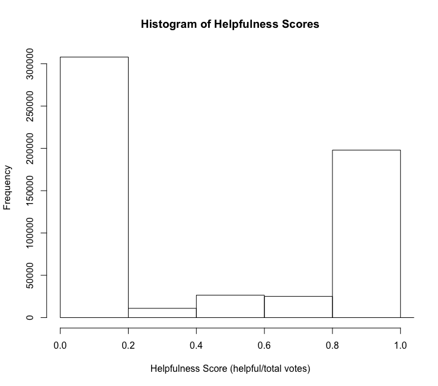

# Helpfulness Score Prediction with Python

Ryan A. Mannion

Georgetown University

Final Project for LING472 - Computational Linguistics
with Advanced Python

Spring 2020

---
The purpose of this project is to predict the helpfulness scores of
reviews left on online marketplaces. Given a review and certain other
metadata, can we engineer features that allow us to accurately predict a
review's helpfulness without the need for users to vote? 

## The Data
The Stanford Network Analysis Project profile on Kaggle has uploaded a
dataset of food reviews from Amazon Fine Foods from a span of 10 years
up to October 2012. The link to that dataset can be found
[here](https://www.kaggle.com/snap/amazon-fine-food-reviews_).

The features will be primarily linguistic features, as there is not much
metadata to work with.

Helpfulness scores range from 0-1, with 0 being not helpful at all and 1
being very helpful (with a ratio of votes for helpful to all votes being
1). 

 

*Image 1: Histogram of Helpfulness Scores*

## The Proposed Methodology

### Model

### Features

### Evaluation

## The Hypothesis

